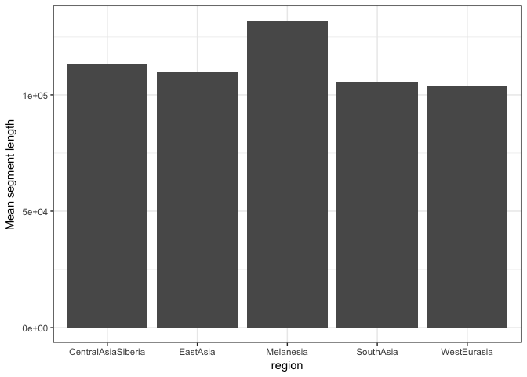

Detecting archaic ancestry in modern humans
-------------------------------------------

The dataset you will be working in this exercise section was kindly
provided by Laurits Skov, the author of the paper you discussed on Monday. He has called archaic fragments
using his method in a large number of individuals from the Simons genome
diversity project and from the 1000 genomes project, paper
[here](https://www.biorxiv.org/content/early/2018/03/16/283606.full.pdf).

The path to the dataset is the following:

```bash
  /home/Data/ArchaicSegments.txt
 ```
Transfer it from the cluster to your local machine and use Rstudio for the rest of the exercise. Here is an example of the code you can use to answer the first set of questions. 

``` r
archaic_df = read.table('ArchaicSegments.txt',
    sep='\t', header = T)

# How many individuals do we have?
length(unique(archaic_df$name))
```

    ## [1] 358

``` r
# How many populations?
length(unique(archaic_df$pop))
```

    ## [1] 110

``` r
# How many regions?
unique(archaic_df$region)
```

    ## [1] EastAsia           WestEurasia        CentralAsiaSiberia
    ## [4] SouthAsia          Melanesia         
    ## Levels: CentralAsiaSiberia EastAsia Melanesia SouthAsia WestEurasia

``` r
# Average archaic segment length by population:
mean_seg_pop <- archaic_df %>%
        group_by(pop, region) %>%
        summarise(`Mean segment length` = mean(length))
  
mean_seg_pop %>%
 ungroup() %>%
  arrange(region) %>% 
    mutate(pop = factor(pop, pop)) %>%
        ggplot(aes(x = pop, y = `Mean segment length`, fill = region)) + 
            geom_bar(position = "dodge", stat="identity") + 
            theme_bw() +
            theme(axis.text.x = element_text(angle = 90, hjust = 1))
```


``` r
# What is the population with the highest average segment length?
mean_seg_pop[which.max(mean_seg_pop$`Mean segment length`),]
```

    ## # A tibble: 1 x 3
    ## # Groups:   pop [1]
    ##   pop     region    `Mean segment length`
    ##   <fct>   <fct>                     <dbl>
    ## 1 Papuans Melanesia                131784

``` r
# What is the average length of segments by region?
mean_seg_region <- archaic_df %>%
        group_by(region) %>%
        summarise(`Mean segment length` = mean(length)) 

# Can you plot it?
ggplot(mean_seg_region, aes(x = region, y = `Mean segment length`)) +  
    geom_bar(position = "dodge", stat="identity") 
    + theme_bw()
```



The lengths of Archaic fragments
--------------------------------

The lengths of the fragments are given by the length variable and is
regarding the segments that appear to have too many SNPs after the
African SNPs have been filtered away. You will
first look at these before classifying them into their most likely
archaic origin

##### Q1. Find the total lengths of Arcahic fragments in each individual.

##### Q2. Get the mean total proportion of archaic fragments on the individuals of a given population.

##### Q3. Which population has most archaic ancestry? Why?

##### Q4. What is the length distribution of fragments for the five different regions (hint: you can use facet\_grid to plot all at once).

##### Q5. What is the average length of fragments for each population and each region?

##### Q6. What can cause different mean fragment lengths?

The origin of archaic fragments
-------------------------------

You can assign individuals fragments to archaic origin using the number of SNPs they share with Denisovans, Altai Neanderthal and Vindija Neanderthal. As a simple first approach, we can assign a fragment to the archaic species with whom shares more
SNPs. If there are no SNPs shared with any of the archaics then considewr the fragment unassigned.

##### Q1. For each individual, assign the archaic segments to origin and reconstruct a Figure in the same style as Figure 5 of the Cell paper (plot below).


##### Q2. Summarize the results by averaging over region and plot these.

##### Q3. Look at the proportion of Denisova SNPs in the individuals assigned closest to Denisova, stratified by region. What do you see?

##### Q4. Determine the fragment length distribution of segments of Neanderthal, Denisova and Unassigned origin separately for each region. Compare the median of the distributions. Try applying some thresholds to the minimum number SNPs shared with the reference genomes.


Comparison of chromosomes
-------------------------

You can also investigate how the introgression events are distributed
along the genome.

##### Q1. Determine the amount of archaic introgression on each chromosome for each of the five regions.

##### Q2. Repeat this with assignment of archaic regions to archaic species.

##### Q3. You will find that the X chromosome is an outlier (compared to a chromosome of a similar size - chr8). How and why?

##### Q4. Combine the Neanderthal fragments for all individuals and plot all the fragments on top of each other along chromosomes (hint use geom_segment() and alpha = 0.02). Can you find “deserts” of archaic admixture and/or evidence for places where Neanderthal or Denisova ancestry has reached very high frequency?

##### Q5. Do you find regions that are devoid of introgression for both the Neanderthal and the Denisovan admixture events?


