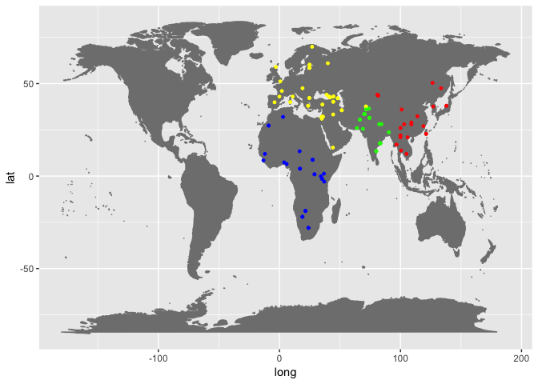

Background
----------

In this exercise section you will analyse positive selection in human populations. You will be looking at the X chromosome of individuals from the Simons genome diversity project. The advantage of X chromosomes in males is that they are haploid, and therefore, fully phased. We also have other reasons to belive that they often experience natural selection. Finally, they have typically not been investigated previously to the same extent as the autosomes.

You will perform many of the same analysis as in the [Sabeti et al. (2007)](https://www.nature.com/articles/nature06250) paper. They used these to find selection in the human HapMap data (SNP data) on the autosomes.

You will have data from the following populations:

| Population  | Individuals |
|-------------|:-----------:|
| Africa      |   26 males  |
| West Europe |   44 males  |
| South Asia  |   30 males  |
| East Asia   |   24 males  |



The data consists of **24198** SNPs from the region 73-81 Mb on the X chromosome and there is no missing data. The haplotype data for each population is found in separate files (**genotypes360\_400\_.**), whereas they use a common SNP identity file **snps360\_400\_filtered.snp**.

You can find these files at:

```bash
/home/Data/
```

Package
-------

The package requires 2 inputs:

1.  The snp file (`snp_ID`, `Chromosome`, `position`, `reference allele` and `derived allele`).

2.  The haplotype file: haplotype of each individual encoded as reference allele, alternative allele and missing data N.

Analysis
--------

You will perform a genome wide scan and then focus on candidate SNPs. The package that you will be using on these analysis is `rehh`. The manual of the package can be found [here](https://cran.r-project.org/web/packages/rehh/rehh.pdf). 

### Reading in data in REHH format

``` r
# Install the package
#install.packages('rehh')
library(rehh)

# Define the directory of your working folder:
setwd("~/Dropbox/PG2018/exercises/rehh")

# Reading the data for each population:
hap360_400_AF <-data2haplohh(hap_file="genotypes360_400_AF",map_file="snps360_400_filtered",
                             recode.allele=TRUE, 
                             min_perc_geno.snp=100,
                             min_perc_geno.hap=80,
                             haplotype.in.columns=TRUE,
                             chr.name=X)
```

    ## Map file seems OK: 24198  SNPs declared for chromosome 1 
    ## Haplotype are in columns with no header
    ## Alleles are being recoded according to map file as:
    ##  0 (missing data), 1 (ancestral allele) or 2 (derived allele)
    ## Discard Haplotype with less than  80 % of genotyped SNPs
    ## No haplotype discarded
    ## Discard SNPs genotyped on less than  100 % of haplotypes
    ## No SNP discarded
    ## Data consists of 26 haplotypes and 24198 SNPs

#### Q1. How many haplotypes and snps are found in each population?

Scan the region using iHS, Rsb and XP-EHH
-----------------------------------------

You should first perform a scan for each of the regions for extreme values of **i**ntegrated **h**aplotype **s**core (iHS). This calculation is done by standardizing to differences in allele frequency. This implies using the functions `scan_hh`, followed by `ihh2ihs` and then plotting the results using either ihsplot or plotting by yourself.

#### Q2. Try also to plot a histogram of the allele frequencies of the SNPs in each population. Do you observe population differences?

Hint: Allele frequencies are calculated and stored as part of the dataframe resulted from scan\_hh. Use (par mfrow) function to combibe the 4 different population plots. Once you have obtained the data\_frame produced by `scan_hh` you can compute the standardized iHS (iHH), as described in [Voight et al. (2006)](http://journals.plos.org/plosbiology/article?id=10.1371/journal.pbio.0040072).

``` r
# Producing the required input dataframe:
res.scanAF<-scan_hh(hap360_400_AF)
res.scanWE<-scan_hh(hap360_400_WE)

head(res.scanAF)
```

    ##              CHR POSITION     freq_A iHH_A iHH_D iES_Tang_et_al_2007
    ## X:X_73263128   1 73263128 0.00000000     0    NA                  NA
    ## X:X_73264012   1 73264012 0.03846154     0    NA                  NA
    ## X:X_73264487   1 73264487 0.03846154     0    NA                  NA
    ## X:X_73264603   1 73264603 0.03846154     0    NA                  NA
    ## X:X_73265256   1 73265256 0.00000000     0    NA                  NA
    ## X:X_73266095   1 73266095 1.00000000    NA     0                  NA
    ##              iES_Sabeti_et_al_2007
    ## X:X_73263128                    NA
    ## X:X_73264012                    NA
    ## X:X_73264487                    NA
    ## X:X_73264603                    NA
    ## X:X_73265256                    NA
    ## X:X_73266095                    NA
    
```r
res.scanAF %>% ggplot() +
  geom_histogram(aes(x=freq_A))
```

#### Q3. For what reason do they standardize iHS measure?

``` r
# Scanning each population at time:
wg.ihsAF<-ihh2ihs(res.scanAF, freqbin = 0.05) 

# Plotting the results:
ihsplot(wg.ihsAF, plot.pval = TRUE)
```

#### Q4. Do you find outliers with significant iHS?

If so, record the SNP positions of the most significant SNPs for later analysis, using e.g. which.max() or which.min().

Perform pairwise population tests
---------------------------------

There are two possible functions to be used, `ies2rsb` and `ies2xpehh`, both require the dataframes of `scan_hh` class.

#### Q5. Can you see the differences between the different methods?

``` r
# Have a look at the differences between the functions:
#?ies2rsb()
#?ies2xpehh()

# Computing ies2rsb between African population over West European population:
wg.rsbAFWE <- ies2rsb(res.scanAF,res.scanWE, popname1 = "Africa", popname2 = "W Europe",
                      method = "bilateral")
```

Use the function rsbplot() and xpehhplot() to explore and plot your results:

``` r
rsbplot(wg.rsbAFWE, plot.pval = T)
wg.XPEHHAFWE <- ies2xpehh(res.scanAF,res.scanWE, popname1 = "Africa", popname2 = "W Europe", method = "bilateral")

xpehhplot(wg.XPEHHAFWE, plot.pval = T)
```

Zooming in interesting markers
------------------------------

From the scan you can find SNPs that give extreme values of iEHS or of XPEHH for a set of populations. You can then analyse the haplotype structure around them. This is done by including the index position of the interested marker in the functions `calc_ehhs` and `bifurcation.diagram`.

``` r
#For African Western Europe the most significant marker is 4901
a = calc_ehhs(hap360_400_WE, mrk=4901)

layout(matrix(1:2,2,1))
diag = bifurcation.diagram(hap360_400_WE,mrk_foc=4901,
                    all_foc=1,nmrk_l=200,
                    nmrk_r=200, 
                    refsize = 0.8,
                    main="Candidate X: Ancestral Allele")
```

#### Q6. What is the biological function of the region around this snp?

Have a look at [NCBI](ncbi.nlm.nih.gov) and remember that this dataset belongs to chromosome X and [HG19](https://www.ncbi.nlm.nih.gov/assembly/GCF_000001405.13/) as reference.
